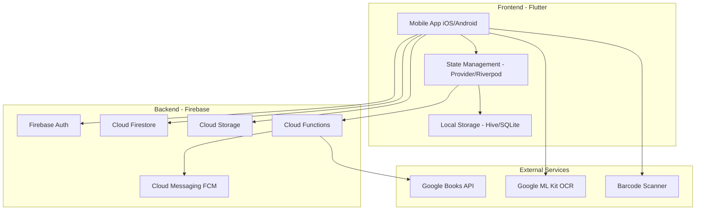

# 🏗️ Tổng Quan Kiến Trúc (Reading Station)

## Stack Công Nghệ

## Nguyên Tắc Thiết Kế
- **Offline-First**: App hoạt động mượt mà khi không có mạng
- **Clean Architecture**: Tách biệt UI, Business Logic, Data Layer
- **Responsive Design**: Tối ưu cho nhiều kích thước màn hình
- **Security-First**: Mọi dữ liệu đều được bảo vệ bởi Firebase Rules
